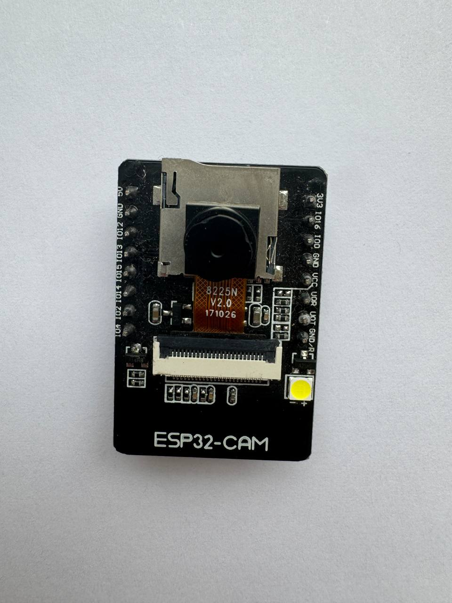
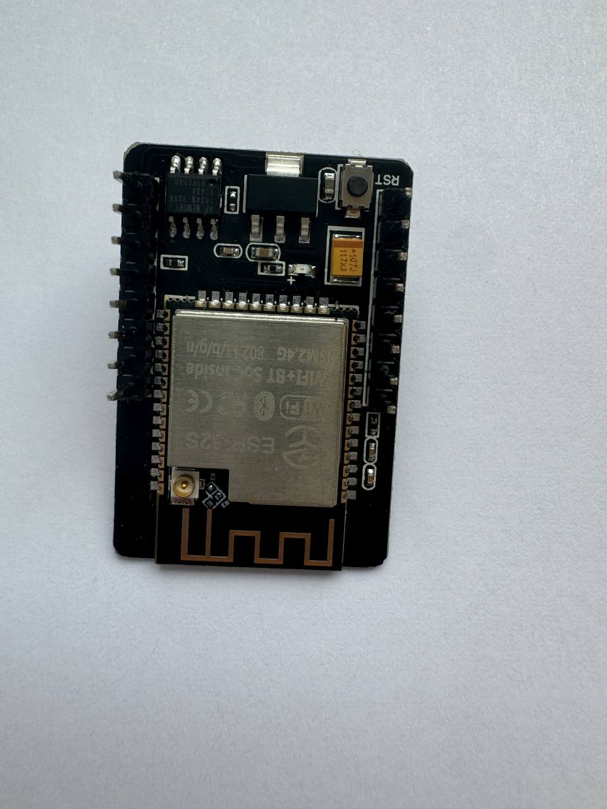
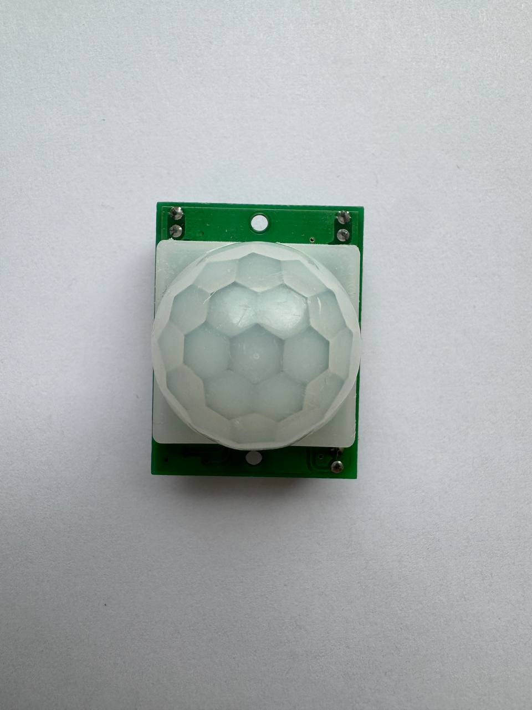
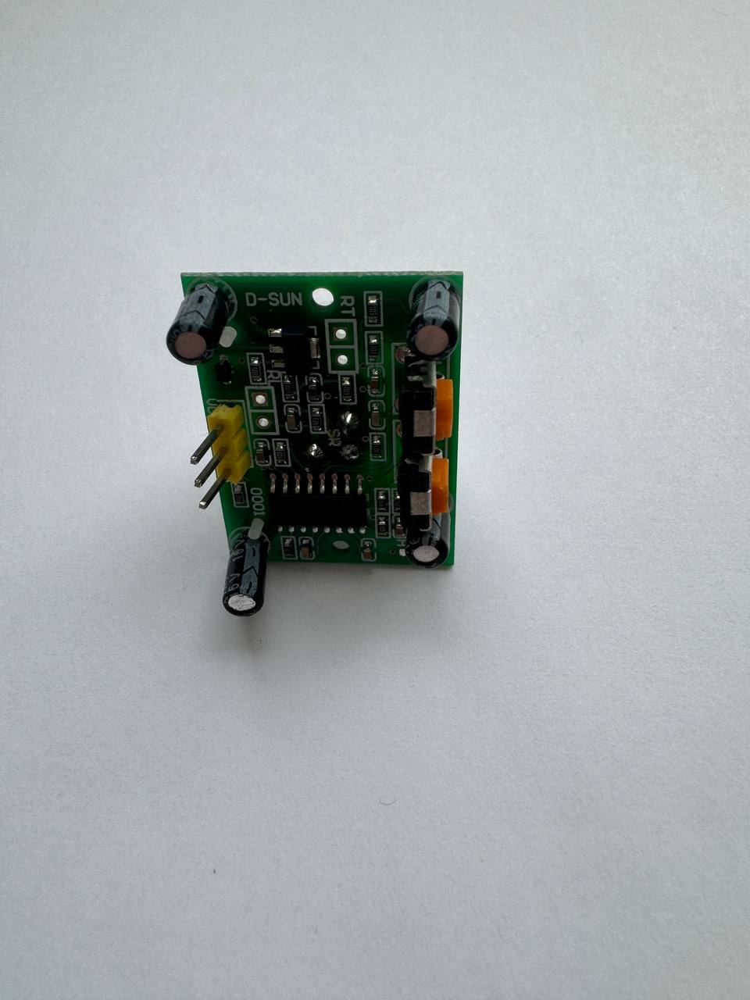
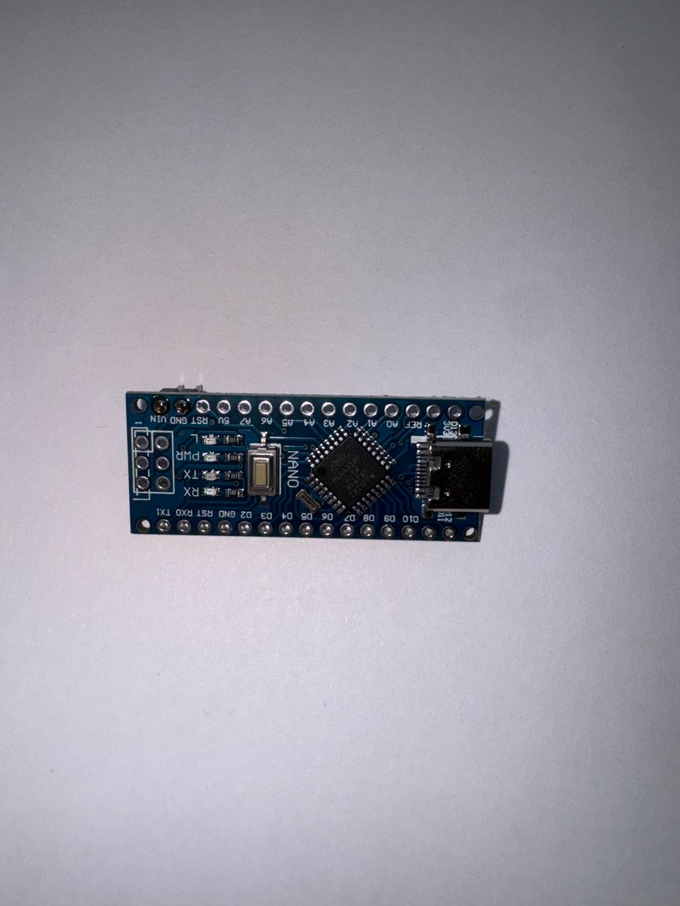
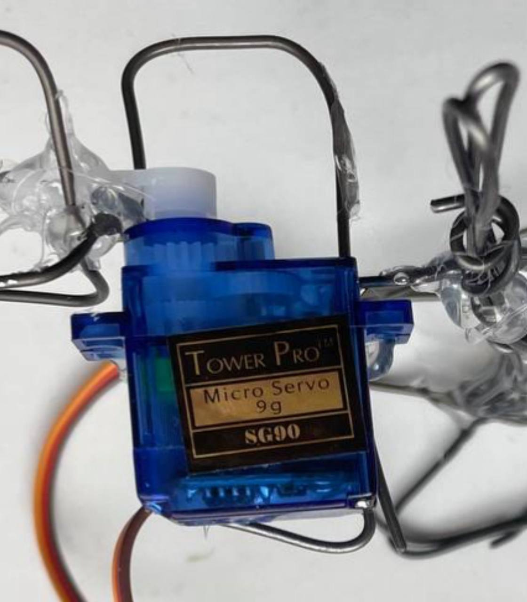
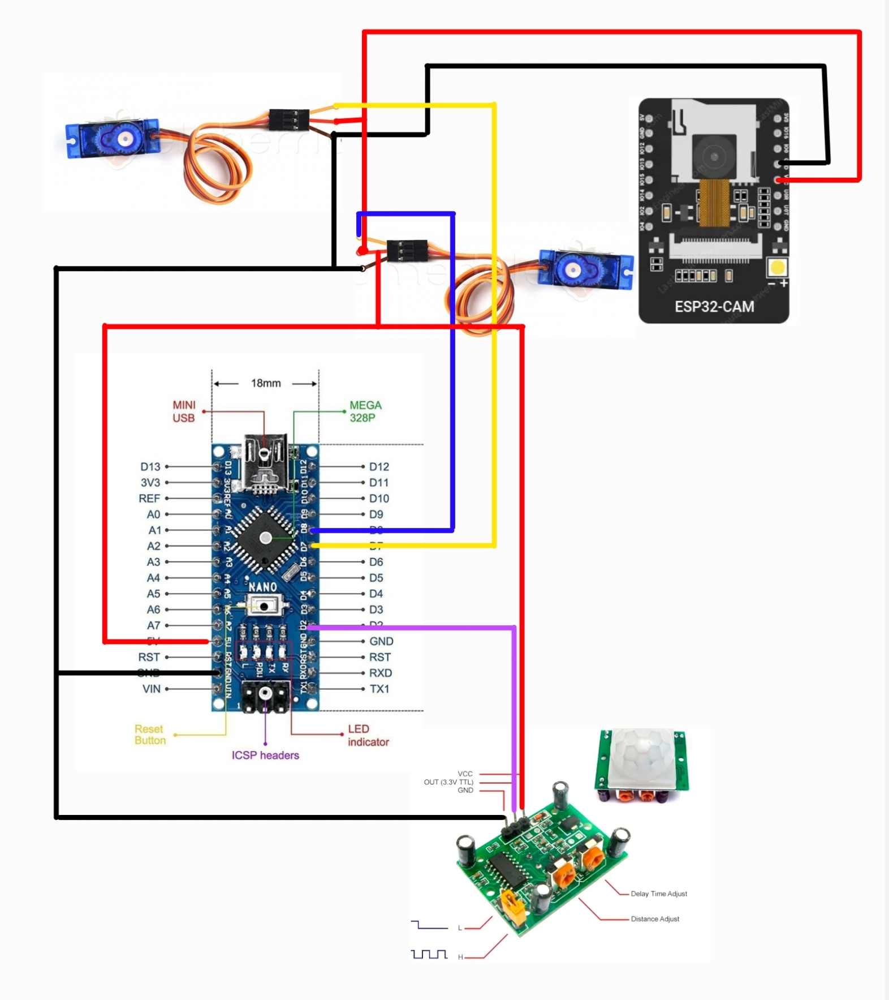
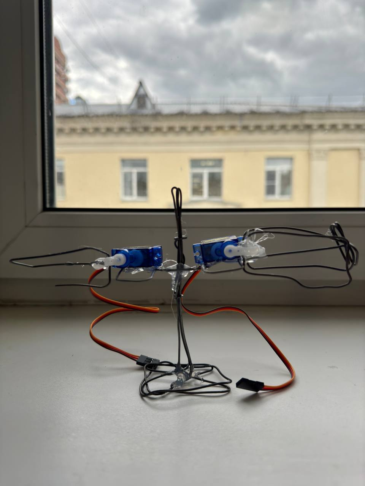
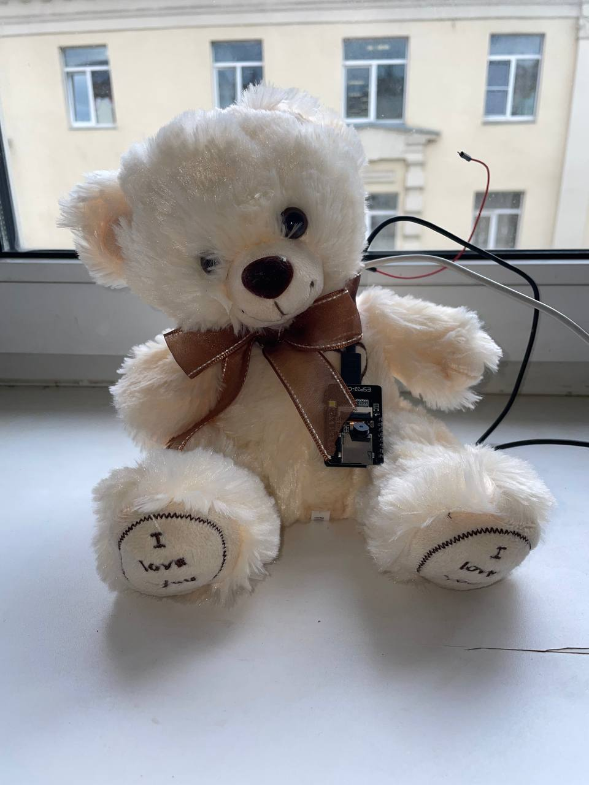

# Interactive toy

## Команда

Ханевская Ксения Б01-307
Шевченко Ульяна  Б01-307

## Цель проекта

Спроектировать и изготовить модель игрушки (медведя), с встроенной в
глаз камерой (ее будет видно) и сервоприводоми в лапах, а также встроенным веб-сервером для отслеживания видео с камеры и управления движениями лап.

## Задачи проекта

1. Подобрать подходящую камеру 
2. Осуществить передачу видео на веб-сервер
3. Осуществить подключение некоторого количества клиентов к веб-серверу
4. Осуществить контроль сервопривода с помощью платы ESP
5. Осуществить разнообразные движения лап (например «волна», махание)
6. Подготовить корпус игрушки

## Принцип работы

В игрушку встроен датчик движения, который отправляет прерывание на основную плату, что приводит в движение сервоприводы (медведь начинает махать лапами).
Изображение с камеры транслируется на локальный сервер.

## Компоненты 

1. Камера ESP32-CAM

2. Датчик движения HC-SR501 для Arduino MCU сенсор

3. Микроконтроллер плата arduino NANO на базе процессора ATMega 328

4. Сервприводы (2 шт.) Micro servo SG90 9g

## Схема сборки

## Получившийся каркас

## Результат

